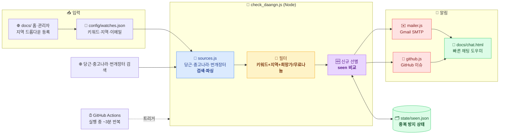
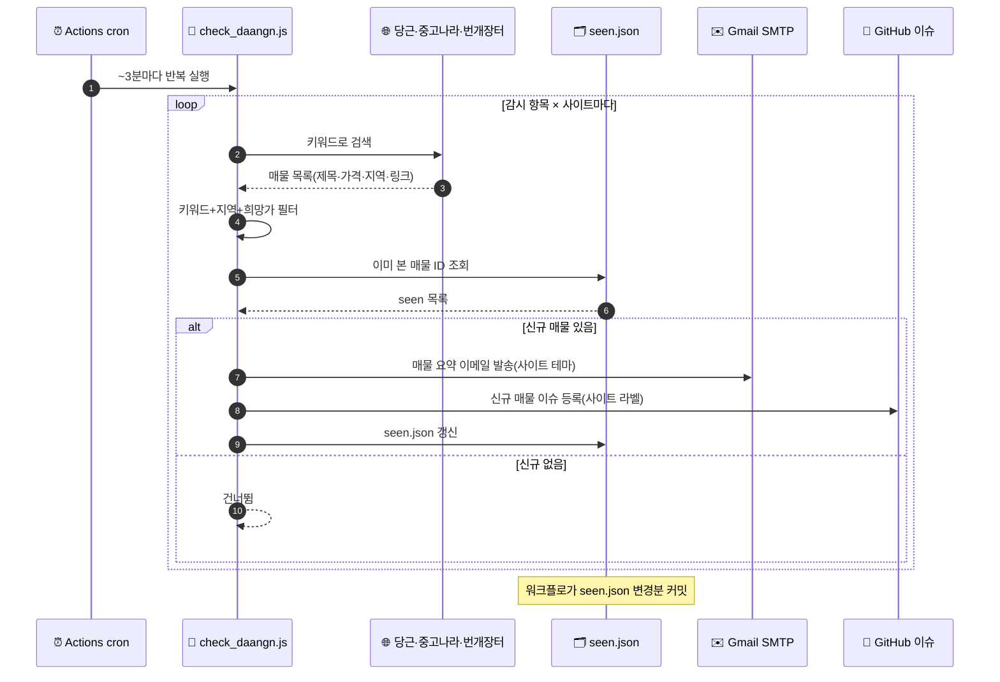
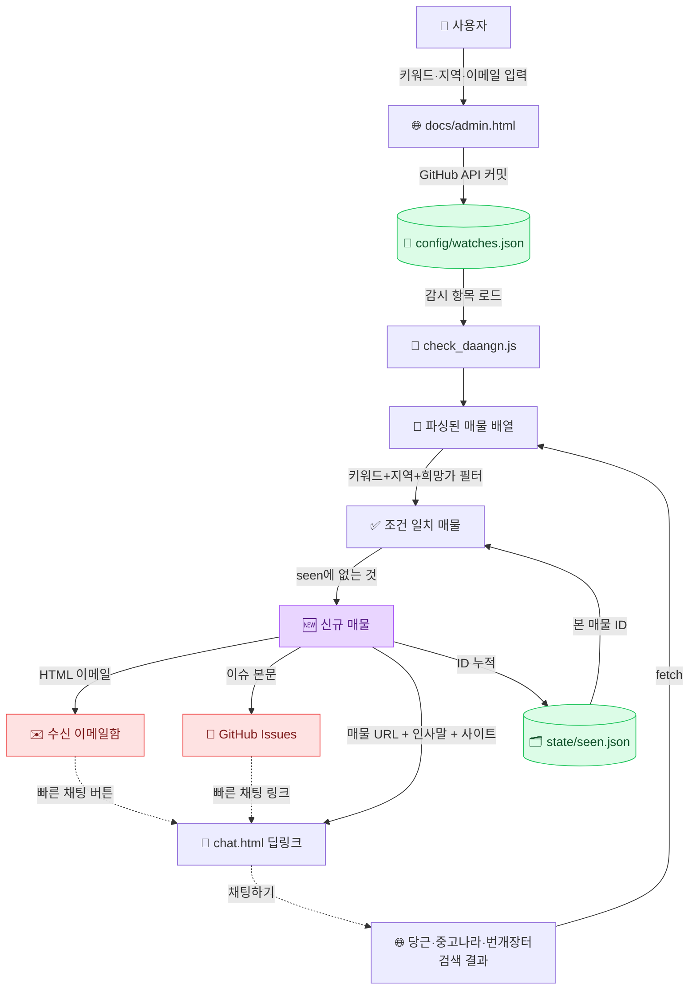

# 🛒 중고 알리미 (used-notifier)

원하는 **제품 키워드**·**구매 지역**·**희망 금액**을 등록하면, [당근마켓](https://www.daangn.com/kr/)과
[중고나라](https://web.joongna.com)·[번개장터](https://www.bunjang.com)에 조건에 맞는 **신규 매물**이 올라올 때 **Gmail 이메일**과
**GitHub 이슈**로 알림을 보내주는 웹앱입니다.

> 예시) 제품 `가마솥`, 지역 `수원시`, 희망가 `100,000원` 을 등록 → 판매 위치가 수원이면서 제목에
> "가마솥"이 포함되고 가격이 10만원 이하인 새 매물이 당근마켓/중고나라/번개장터에 올라오면, 지정한 이메일로
> 매물 정보와 구매 링크가 도착합니다. 감시 항목마다 검색할 사이트를 선택할 수 있습니다.
>
> **무료 매물만 찾을 때:** 간편 등록 또는 감시 목록 관리에서 **🎁 무료나눔**을 체크하세요.
> 희망 금액이 자동으로 `0원`이 되고, 당근의 **나눔** 및 중고나라·번개장터의 **0원** 매물만 알립니다.

---

## 🧩 한눈에 보기

감시 목록(`config/watches.json`)을 기준으로 당근마켓·중고나라·번개장터를 **검색**하고, 신규 매물만 **선별**해
**이메일·GitHub 이슈** 두 갈래로 **알림**을 보내는 단일 파이프라인입니다. GitHub Actions가
실행되면 **한 job 안에서 약 3분마다 반복 점검**하여 신규 매물을 빠르게 잡아냅니다.



| 단계 | 모듈 | 한 줄 설명 |
|---|---|---|
| 🧭 **소스 레지스트리** | [`scripts/sources.js`](scripts/sources.js) | 사이트(당근/중고나라/번개장터) 등록·감시 항목별 검색 사이트 결정 |
| 📡 **검색·파싱** | [`daangn.js`](scripts/daangn.js) · [`joongna.js`](scripts/joongna.js) · [`bunjang.js`](scripts/bunjang.js) | 사이트별 검색 결과를 공통 매물 형태로 정규화 |
| 🔎 **필터** | [`scripts/daangn.js`](scripts/daangn.js) | 제목에 키워드 포함 + 지역 일치 + 희망가 이하(3개 사이트 공통 규칙) |
| 🆕 **신규 선별** | [`scripts/check_daangn.js`](scripts/check_daangn.js) | (감시 항목 × 사이트)별로 `state/seen.json`과 비교해 새 매물만 추출 |
| ✉️ **이메일** | [`scripts/mailer.js`](scripts/mailer.js) | Gmail SMTP로 사이트 테마 색상의 매물·구매 링크·빠른 채팅 버튼 발송 |
| 🐙 **이슈** | [`scripts/github.js`](scripts/github.js) | 신규 매물을 사이트별 라벨(`당근마켓-알림`·`중고나라-알림`·`번개장터-알림`) 이슈로 등록 |
| 🎨 **테마** | [`scripts/theme.js`](scripts/theme.js) · [`docs/assets/theme.js`](docs/assets/theme.js) | 사이트별 브랜드 색상(당근 주황·중고나라 녹색·번개장터 파랑)을 이메일·웹에 일관 적용 |
| 🌐 **웹 UI** | [`docs/`](docs) | 대시보드·사이트별 매물 알림·감시목록 관리·간편등록·무료나눔 등록·빠른 채팅 (GitHub Pages) |
| ⏰ **자동화** | [`daangn-alert.yml`](.github/workflows/daangn-alert.yml) | 실행되면 job 내부에서 ~3분마다 반복 점검·알림·상태 커밋 |

---

## 동작 흐름 (Operation Flow)

GitHub Actions 가 실행되면 아래 순서를 ~3분마다 반복합니다. 각 감시 항목/알림 채널은 독립적으로
실패를 흡수하므로 한 항목이 실패해도 나머지는 계속 진행됩니다.



1. **검색** — `check_daangn.js`가 감시 항목마다 지정된 사이트(당근마켓·중고나라·번개장터)를 각각 검색·파싱합니다.
2. **필터** — 제목에 키워드가 있고 지역이 일치하며(미입력 시 전국), 양수 희망가는 해당 금액 이하, `0원`은 무료 매물만 남깁니다.
3. **선별** — (감시 항목 × 사이트)별로 `state/seen.json`과 비교해 아직 알리지 않은 신규 매물만 고릅니다.
4. **알림** — 이메일과 GitHub 이슈로 각각 발송(하나라도 성공하면 상태 갱신).
5. **기록** — `seen.json`을 갱신·커밋해 다음 실행 때 중복 알림을 막습니다.

---

## 데이터 플로 (Data Flow)

데이터는 **감시 설정 → 검색 결과 → 신규 매물 → 알림/상태**로 흐릅니다. `watches.json`과
`seen.json` 두 파일이 진실의 원천이며, 홈페이지·관리자는 `watches.json`을, 워크플로는
`seen.json`을 읽고 씁니다.



| 데이터 | 위치 | 역할 |
|---|---|---|
| 감시 설정 | `config/watches.json` | 키워드·지역·희망가·사이트·이메일·인사말 (홈/관리자가 기록) |
| 검색 결과 | (메모리) | 당근·중고나라·번개장터 검색 결과를 파싱한 매물 배열 |
| 신규 매물 | (메모리) | 필터 통과 & `seen`에 없는 매물 |
| 중복 방지 상태 | `state/seen.json` | (감시 항목 × 사이트)별 이미 알린 매물 ID (워크플로가 커밋) |
| 알림 결과 | 이메일 / GitHub 이슈 | 매물 정보 + 구매 링크 + 빠른 채팅 도우미 |

---

## 구성

| 경로 | 설명 |
| --- | --- |
| `docs/index.html` | 대시보드(GitHub Pages). 감시 항목·최근 알림을 한눈에 표시하고 무료 감시는 **`0원(무료나눔)`**로 표시 (**회색 테마**) |
| `docs/issues.html` | 사이트별 매물 알림 목록. `?site=daangn\|joongna\|bunjang` 에 따라 **주황/녹색/파랑** 테마 |
| `docs/admin.html` | 감시 목록 관리. GitHub API로 조회·추가·수정·삭제하고, **무료나눔** 선택을 포함해 커밋 |
| `docs/add.html` | 간편 등록. 지역 드롭다운·**무료나눔** 메뉴로 감시 항목 설정 코드 생성 |
| `docs/help.html` | 도움말 |
| `docs/chat.html` | 빠른 채팅 도우미. 이메일/이슈에서 열려 인사말 복사 + 해당 사이트 매물 채팅 화면으로 이동 |
| `docs/assets/` | 공용 네비게이션(`nav.js`)·테마(`theme.js`)·GitHub 데이터(`gh-data.js`)·페이지 스크립트·스타일 |
| `config/watches.json` | 감시 목록(키워드/지역/희망가/사이트/이메일) |
| `scripts/` | 당근·중고나라·번개장터 검색·파싱·이메일·이슈 발송 Node 스크립트 |
| `state/seen.json` | 이미 알림 보낸 매물 ID (중복 방지, 워크플로가 자동 커밋) |
| `.github/workflows/daangn-alert.yml` | GitHub Actions (job 내부에서 ~3분마다 반복 점검) |

> 전체 동작은 위의 [한눈에 보기](#-한눈에-보기) · [동작 흐름](#동작-흐름-operation-flow) ·
> [데이터 플로](#데이터-플로-data-flow) 다이어그램을 참고하세요.

---

## 설정 방법

### 1. Gmail 앱 비밀번호 발급
1. 발신용 Gmail 계정에서 **2단계 인증**을 켭니다.
2. [앱 비밀번호](https://support.google.com/accounts/answer/185833)에서 16자리 비밀번호를 발급합니다.

### 2. GitHub Secrets / Variables 등록
저장소 **Settings → Secrets and variables → Actions** 에서 등록합니다.

**Secrets** 탭 (`New repository secret`) — 민감정보:

| 이름 | 값 |
| --- | --- |
| `GMAIL_APP_PASSWORD` | 위에서 발급한 앱 비밀번호(16자리) |
| `DAANGN_COOKIE` | (선택) 당근 **내 동네** 매물을 받기 위한 로그인 세션 쿠키. 아래 참고 |

**Variables** 탭 (`New repository variable`) — 비민감정보:

| 이름 | 값 |
| --- | --- |
| `GMAIL_USER` | 발신 Gmail 주소 (예: `myname@gmail.com`) |
| `MAIL_FROM_NAME` | (선택) 발신자 표시 이름 |

> ℹ️ `GMAIL_USER` 는 이메일 주소일 뿐 민감정보가 아니므로 **Variables** 에 두는 것을 권장합니다.
> 워크플로는 `vars.GMAIL_USER` 를 먼저 읽고 없으면 `secrets.GMAIL_USER` 로 폴백하므로,
> 둘 중 **어느 쪽에 등록해도** 동작합니다. `GMAIL_APP_PASSWORD` 는 반드시 **Secrets** 에 두세요.

#### 🥕 당근 "내 동네" 매물 받기

당근 웹 검색은 **지역을 지정하지 않으면 기본 지역(서초4동)** 결과만 줍니다. 내 동네 매물을
받으려면 감시 항목의 `daangnRegion`에 당근 검색 URL의 `in=` 값을 넣으세요(**로그인 불필요**).

1. 브라우저에서 [daangn.com 검색](https://www.daangn.com/kr/buy-sell/s/) 을 열고 왼쪽 위 **지역**을 내 동네로 변경
2. 아무 키워드나 검색한 뒤 주소창 URL의 `in=` 값을 복사 — 예: `…?in=매탄동-4535&search=…`
3. 감시 항목에 `"daangnRegion": "매탄동-4535"` 로 저장

> ⚠️ **정확한 지역 코드**가 중요합니다 — 코드가 틀리면 기본 지역(서초4동)으로 되돌아갑니다.
> 검색기는 파싱 가능한 `/kr/buy-sell/?search=…&in=<코드>` 경로로 그 동네를 직접 조회합니다.
> (신형 `/kr/buy-sell/s/` 경로는 결과가 PoW 봇 차단으로 보호돼 사용하지 않습니다.)

(선택) 로그인해야만 보이는 결과까지 필요하면 **로그인 세션 쿠키**를 `DAANGN_COOKIE` **Secret** 으로 추가할 수 있습니다.

1. PC 브라우저에서 [daangn.com](https://www.daangn.com/kr/buy-sell/) 에 **로그인**하고 내 동네를 확인
2. **개발자도구(F12) → Network** 에서 `buy-sell` 요청 클릭 → **Request Headers** 의 `cookie:` 값 전체 복사
3. **Secrets** 탭에 `DAANGN_COOKIE` = 복사한 쿠키값 등록

쿠키가 있으면 당근 검색이 그 계정 동네로 한정되며 지역 텍스트 필터는 자동으로 건너뜁니다.
쿠키는 **민감정보**이고 로그아웃/일정 기간 후 **만료**되므로 만료 시 다시 발급해 갱신하세요.
쿠키를 등록하지 않으면 당근은 서초4동 결과만 나오므로, 다른 지역 감시는 지역 데이터가 정확한
**중고나라·번개장터**가 담당합니다.

### 3. 감시 항목 등록

**방법 A — 웹 관리자 (권장):** [관리자 페이지](https://leemgs.github.io/used-notifier/admin.html)에서
감시 항목을 **조회·추가·수정·삭제**하고 GitHub에 바로 저장합니다.
파일을 직접 편집할 필요가 없습니다.

- GitHub **Fine-grained 토큰**(이 저장소, Contents Read and write)이 필요합니다.
  [토큰 만들기](https://github.com/settings/personal-access-tokens/new)
- 토큰은 브라우저 `localStorage` 에만 저장되며 서버로 전송되지 않습니다.
  공용 PC에서는 사용 후 "토큰 삭제"를 누르세요.

**방법 B — 수동 편집:** [홈페이지](https://leemgs.github.io/used-notifier/)에서 설정 코드를 생성하거나
`config/watches.json` 을 직접 편집합니다.

```json
{
  "defaultEmail": "myname@gmail.com",
  "watches": [
    {
      "id": "gamasot-suwon",
      "keyword": "가마솥",
      "location": "수원시",
      "email": "myname@gmail.com",
      "enabled": true
    },
    {
      "id": "free-chair-all",
      "keyword": "의자",
      "location": "",
      "maxPrice": 0,
      "sites": ["daangn", "joongna", "bunjang"],
      "email": "myname@gmail.com",
      "enabled": true
    }
  ]
}
```

| 필드 | 설명 |
| --- | --- |
| `keyword` | 조회할 제품 키워드 (매물 제목에 포함되면 매칭) |
| `sites` | 검색할 사이트 배열 `["daangn","joongna","bunjang"]`. **미지정이면 전체(당근+중고나라+번개장터)** |
| `location` | 구매 가능 지역 (매물 지역/제목에 포함되면 매칭). **비우면 전국** |
| `maxPrice` | 희망 금액(원). 양수는 해당 금액 **이하**, `0`은 무료 매물(당근 **나눔**, 중고나라·번개장터 **0원**)만 알림. 미지정이면 제한 없음 |
| `email` | 알림 수신 이메일 (없으면 `defaultEmail` 사용). **여러 명**은 배열 `["a@x.com","b@y.com"]` 또는 쉼표구분 문자열 `"a@x.com, b@y.com"` |
| `chatMessage` | 채팅 도우미에 미리 채울 인사말 (없으면 `defaultChatMessage`) |
| `enabled` | `false` 면 검사 제외 |

### 🎁 무료나눔 감시

| 구분 | 동작 |
| --- | --- |
| UI 등록 | 간편 등록·감시 목록 관리에서 **무료나눔**을 체크하면 금액 입력란이 `0`으로 바뀌고 비활성화됩니다. |
| 저장 값 | 감시 항목에 `"maxPrice": 0`으로 저장됩니다. 체크를 풀면 0원이 지워지고 일반 희망 금액을 다시 입력할 수 있습니다. |
| 필터 | 가격을 알 수 없는 매물이나 1원 이상 매물은 제외하고, 가격 값이 정확히 `0`인 매물만 통과시킵니다. |
| 사이트별 표기 | 당근마켓은 **나눔**, 중고나라·번개장터는 **0원**으로 알림에 표시됩니다. |
| 대시보드 | **감시 중인 키워드** 항목에 `0원(무료나눔)`로 표시됩니다. |

> 파일을 직접 수정할 때도 `maxPrice`를 `0`으로 설정하면 동일하게 작동합니다. `maxPrice`를
> 생략하는 것은 **금액 제한 없음**이므로 `0`과 다릅니다.

최상위 옵션: `sendEmail`(기본 true) · `createIssues`(기본 true) 로
이메일/이슈 알림을 각각 켜고 끌 수 있습니다.

### 알림 채널 (이메일 + GitHub 이슈)
신규 매물이 발견되면 **GitHub 이슈 등록**과 **이메일 발송**을 함께 수행합니다.

- **GitHub 이슈**: (감시 항목 × 사이트)별로 신규 매물 목록을 담은 이슈가 사이트 라벨
  (`당근마켓-알림`·`중고나라-알림`·`번개장터-알림`)로 생성됩니다. Actions 가 자동 제공하는
  `GITHUB_TOKEN` 을 사용하므로 별도 설정이 필요 없고, 워크플로에 `issues: write` 권한이
  포함되어 있습니다. 거래 확인 후 이슈를 닫으면 됩니다.
- **이메일**: 위 Gmail SMTP 설정 필요. 제목/버튼/배경이 사이트 브랜드 색상(당근 주황·중고나라
  녹색·번개장터 파랑)으로 표시되고, "○○에서 보기 →" 버튼이 해당 사이트 매물로 연결됩니다.

### 지역(location) 매칭 규칙
- **비워두면 전국** 대상으로 조회합니다 (`전국`, `전체` 입력도 동일).
- 지역을 넣으면 매물 위치/제목에 그 지역명이 포함될 때 매칭됩니다.
  행정구역 접미사를 뗀 어간도 함께 비교합니다 (`수원시` → `수원`).
- ⚠️ 당근은 매물 위치를 동 이름(예: `영통동`)만 표시하는 경우가 있어, 시 단위 입력이
  일부 매물과 매칭되지 않을 수 있습니다. 이럴 땐 동 이름으로 등록하거나 지역을 비워
  전국으로 받은 뒤 이메일/이슈에서 위치를 확인하세요.
  (`DEBUG=true` 로 실행하면 파싱/매칭 건수를 로그로 확인할 수 있습니다.)

### 빠른 채팅 도우미 (💬)
이메일/이슈의 **"💬 빠른 채팅"** 버튼을 누르면 `docs/chat.html` 도우미 페이지가 열립니다.
링크에 사이트 정보(`site=…`)가 함께 전달되어, 도우미 페이지가 **해당 사이트의 색상·문구**로
표시됩니다(구버전 링크는 매물 URL 호스트로 사이트를 자동 유추).

1. **인사말 복사** 버튼으로 미리 준비된 문구(예: "안녕하세요. 제가 구매 가능할까요?")를 복사
2. **○○ 매물에서 채팅하기** 버튼으로 해당 사이트(당근마켓/중고나라/번개장터) 매물 페이지로 이동
3. 매물의 **"채팅하기"** 를 눌러 붙여넣기 후 전송

> ⚠️ 각 중고거래 플랫폼은 로그인/메시지 전송의 완전 자동화 시 이용약관 위반과 계정 정지
> 위험이 있습니다. 그래서 이 도우미는 **인사말 복사와 채팅 화면 이동까지만** 자동화하고,
> 최종 전송은 사용자가 직접 누르도록 설계했습니다.

`CHAT_HELPER_URL` 환경변수로 도우미 페이지 주소를 바꿀 수 있습니다.
(기본값: `https://leemgs.github.io/used-notifier/chat.html`)

### 4. GitHub Pages 활성화 (홈페이지)
저장소 **Settings → Pages → Source** 를 `main` 브랜치 `/docs` 폴더로 지정하면
`https://<사용자>.github.io/used-notifier/` 에서 홈페이지가 열립니다.

---

## 로컬 테스트

```bash
cd scripts
npm install

# 이메일을 보내지 않고 검색 결과만 확인 (DRY_RUN)
DRY_RUN=true node check_daangn.js

# 무료나눔 필터·사이트별 0원 표기 포함 자동 테스트
npm test

# 실제 발송 테스트
GMAIL_USER=me@gmail.com GMAIL_APP_PASSWORD=xxxx node check_daangn.js
```

### 유용한 환경변수
| 변수 | 설명 |
| --- | --- |
| `DRY_RUN=true` | 이메일/이슈 발송 없이 신규 매물만 로그 출력 |
| `DEBUG=true` | 사이트별 파싱/매칭 건수를 로그로 출력 |
| `DAANGN_SEARCH_URL` | 당근마켓 검색 URL 템플릿 재정의 (`{kw}` 가 키워드로 치환) |
| `JOONGNA_SEARCH_URL` | 중고나라 검색 페이지 URL 재정의 (`{kw}` 치환) |
| `BUNJANG_SEARCH_URL` | 번개장터 검색 API URL 재정의 (`{kw}` 치환) |
| `CHAT_HELPER_URL` | 빠른 채팅 도우미 페이지 주소 재정의 |
| `MAIL_FROM_NAME` | 이메일 발신자 표시 이름 |
| `STRICT_REGION=false` | 매물에 지역 정보가 없을 때도 통과시킴(관대한 매칭) |

---

## 참고 / 한계
- **검색 방식**: 당근마켓은 웹 검색 페이지 파싱(`scripts/daangn.js`), 중고나라는 검색 API +
  임베드 JSON 폴백(`scripts/joongna.js`), 번개장터는 공개 검색 API(`scripts/bunjang.js`)를
  사용합니다. 사이트 구조가 바뀌면 해당 모듈의 파싱 로직만 수정하면 됩니다.
- **웹 브랜드 테마**: 공용 페이지(대시보드·감시목록·간편등록·도움말)는 회색, 사이트 페이지는
  당근 주황·중고나라 녹색·번개장터 파랑으로 표시됩니다. 색상은 [`docs/assets/theme.js`](docs/assets/theme.js)
  (웹)와 [`scripts/theme.js`](scripts/theme.js)(이메일/이슈)에서 함께 정의하므로, 바꿀 때 두 파일을 맞춰 수정하세요.
- **대시보드의 GitHub API 한도**: GitHub Pages는 토큰 없이 브라우저에서 이슈를 읽으므로
  미인증 REST API 한도(60회/시간·IP)가 적용됩니다. 회사망 등 공유 IP에서는 "요청 한도를
  초과했습니다" 안내가 뜰 수 있으며, 매시각 리셋되면 자동 복구됩니다. 호출을 줄이기 위해
  이슈는 한 번에 받아 사이트별로 분류하고 결과를 3분간 세션 캐시합니다("새로고침"은 캐시 우회).
- 실행 주기(cron)는 `.github/workflows/daangn-alert.yml` 에서 조정할 수 있습니다.
  (GitHub Actions 스케줄은 부하에 따라 몇 분 지연될 수 있습니다.)
- 개인적/비상업적 용도로 사용하고, 각 사이트의 이용약관과 과도한 요청 자제를 준수하세요.
